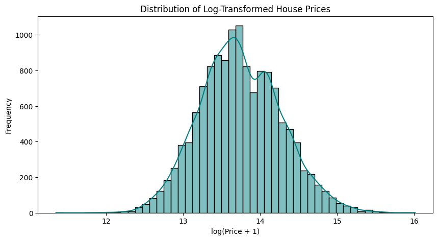

**Melbourne House Price Prediction ( Regression Problem)**

An end-to-end Machine Learning project to predict housing prices in Melbourne, Australia. Built using XGBoost, FastAPI (for serving predictions), and Streamlit (for interactive frontend).

**Dataset**

The used dataset in the project is taken from https://www.kaggle.com/datasets/dansbecker/melbourne-housing-snapshot/data. The dataset has 13580 rows and 21 columns. Both types of features (Categorical and Numerical are present in the dataset).
Numerical features = 'Rooms', 'Distance','Postcode','Bedroom2','Bathroom', 'Car', 'Landsize', 'BuildingArea', 'Lattitude','Longtitude','Propertycount','Address'
Categorical features = 'Suburb','Type', 'Method', 'SellerG', 'CouncilArea', 'Regionname', 'Date', 'YearBuilt'
! Lots of missing values are present in the dataset and preprocessing was carried out using imputation techniques in the pipeline.

 **Important Aspects**
 1. Cleaning and Preprocessing of a real-world Melbourne Housing Dataset.
 2. Performing Exploratory Data Analysis (EDA) for better understanding of the data and viewing the insights.
 3. Regression Techniques such as Linear Regression, XgBoost and Random Forest are used for training of the models.
 4. The target (which is the price in this case) is log-transformed to minimize the skewness and improve the performance of the model.
 5. The model is evaluated using the evaluation metrics such as (R2 score, Mean Absolute Error and Mean Squared Error)
 6. FastAPI is used for backend serving predictions.
 7. Streamlit serves the purpose for UI and user can input using it.
 8. The coding is done in VS code having a modular structure creating virtual environment and also requirements.txt
 9. The project is uploaded by using git.

**Exploratory Data Analysis**

EDA is performed for the dataset inorder to get important insights of the used dataset. Some of the plots are listed here to have a better idea of the dataset and the relationships among the present features.

Understanding the distribution of the target variable (Price) is crucial before applying any predictive modeling techniques.
Key Observations:
The distribution is right-skewed (positively skewed), meaning:

Most house prices are concentrated below $1.5 million.

A small number of homes are priced significantly higher (outliers > $4M and even up to $8M+).

Why This Matters:
Many machine learning models (like Linear Regression) assume normality in the target variable. This plot helps you decide:

Whether to apply a log transformation to normalize the price distribution.

Whether to remove or cap outliers to improve model performance.

A more normally distributed price variable can lead to better model accuracy and stability.

Due to the skewness, log transformation is applied to the target variable to get a uniform distribution and better results.

Applying log transformation results in the reduction of the skewness and help in acheiving uniform distribution. This will further reflect in the models performance, R2 scores are drastically improved.

This forth image is a scatter plot of House Price vs. Land Size from the Melbourne Housing Dataset, another important part of EDA. This is a scatter plot showing the relationship between Land Size (m²) and House Price.
X-axis: Land Size in square meters.
Y-axis: House Price.
Each point represents a single property. 

Key Insights from the Plot
There's no strong linear trend between land size and price.
Most properties are clustered below 1,000 m² and under $2 million.
Some outliers exist — properties with very large land sizes or extremely high prices.
Larger land size does not necessarily mean higher price, suggesting other features (e.g., location, building area, rooms) might be more important.

This is a correlation heatmap of the Melbourne Housing Dataset showing how strongly each numerical feature (like Rooms, Distance, Landsize, etc.) correlates with each other ,especially the target variable, Price.

Values range from -1 to +1:

+1: perfect positive correlation

-1: perfect negative correlation

0: no correlation

The color scale helps visualize:

Red = strong positive correlation

Blue = negative correlation

White/light color = weak or no correlation

Key Insights
Price is moderately positively correlated with:

Rooms (0.50)

Bedroom2 (0.48)

Bathroom (0.47)

Car (0.24)

BuildingArea (0.09, weak but positive)

Negative correlation with Price:

Distance (-0.16): properties farther from the center are slightly cheaper.

Latitude (-0.21): slight trend that price decreases with increasing latitude.
Some of the Key Observations are:
Strongest positive correlations with Price: Rooms, Bedroom2, Bathroom.

Weak negative correlation with Distance and Latitude.

## Model Performance (with log-transformed prices) 
**Evaluation Metrics**

| Model            | R² Score | MAE     | MSE     |
|------------------|----------|---------|---------|
| Linear Regression| 0.7822   | 0.1834  | 0.0595  |
| Random Forest    | 0.8722   | 0.1380  | 0.0349  |
| XGBoost          | 0.8765   | 0.1386  | 0.0337  |

The results confirmed the fact that XGBoost outperformes the other models. Also Random Forest did a good job with a R2 score of 0.8722. This confirms the fact the tree models mostle perform better compared to linear models for countering non-linear data.

**FASTAPI**
FASTAPI is used for wrapping the ML model in an API, which can the frontend, the latter sending data and get back predictions as JSON.

The api is also tested using POSTMAN.

**Streamlit**

A frontend UI is created for which can connect with the ml model wrapped in an api and sends data to get back response in JSON.

**Tech Stack**

- Python 3.11
- [pandas](w), [scikit-learn](w), [xgboost](w)
- [FastAPI](w)
- [Streamlit](w)
- [joblib](w)
- VS Code + Git

---

